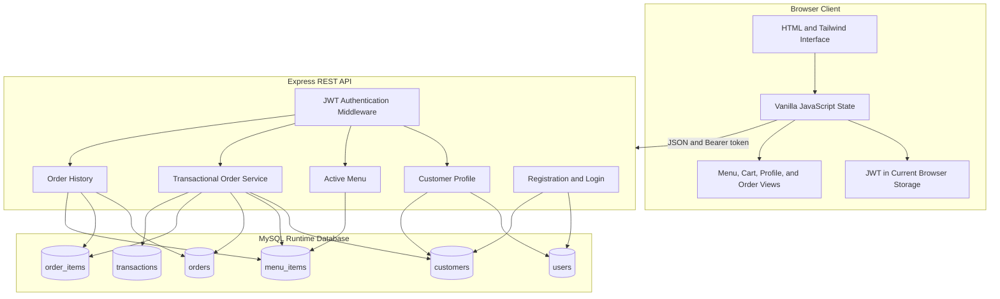
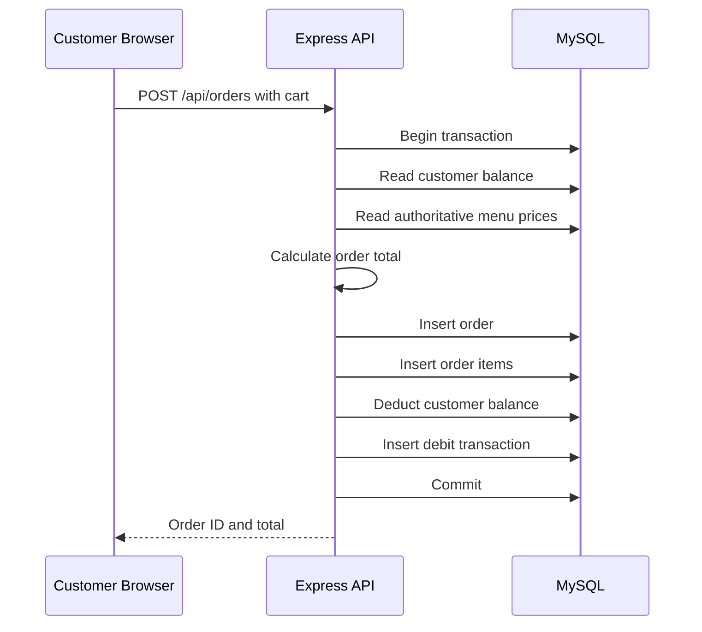
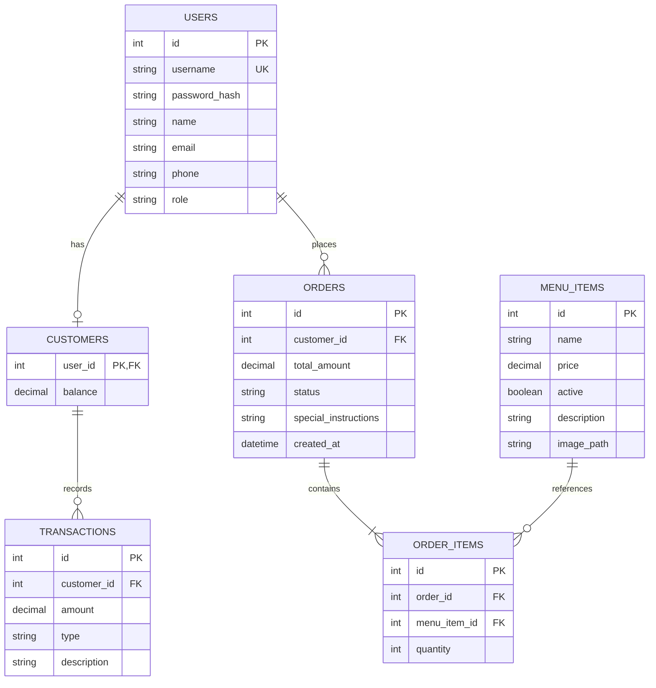

# UniMeal: Student Meal Ordering and Balance Management

> A course-scale full-stack database application for menu browsing, prepaid balance tracking, transactional ordering, and order history.

[](https://nodejs.org/)
[](https://expressjs.com/)
[](https://www.mysql.com/)
[](https://developer.mozilla.org/docs/Web/JavaScript)


## Overview

UniMeal is a full-stack meal-management prototype designed around a university residence or shared-meal service. Registered customers can authenticate, review available menu items, build a cart, place an order using a simulated prepaid balance, and inspect their previous orders.

The project demonstrates relational data modeling, authenticated REST APIs, password hashing, role checks, SQL transactions, client-side state management, and a responsive light/dark interface.

> **Current status:** UniMeal is a DBMS laboratory prototype, not a production payment or food-ordering service. The repository requires security and reproducibility repairs before it should be deployed publicly.


## Implemented Features

| Area | Capability | Status |
|---|---|---|
| Authentication | Customer registration and login | Implemented |
| Password security | bcrypt password hashing | Implemented |
| Session authorization | JWT-protected customer endpoints | Implemented, secret handling requires repair |
| Customer profile | Name, contact information, and balance retrieval | Implemented |
| Menu | Active menu-item retrieval | Implemented |
| Cart | Add items and update quantities in browser state | Implemented |
| Ordering | Server-side price lookup and order-total calculation | Implemented |
| Transaction processing | Order, items, balance, and debit record in one SQL transaction | Implemented |
| Order history | Customer-specific historical orders | Implemented |
| Themes | Persistent light/dark mode | Implemented |
| Responsive UI | Desktop and mobile layouts | Implemented |
| Recharge | Navigation placeholder | Not implemented |
| Administration | Menu, order-status, and user management | Not implemented |
| Production payments | External payment integration | Not implemented |
| Automated tests | API, database, and UI tests | Not implemented |

---

## System Architecture



### Order Transaction



The transaction structure is a genuine strength: either the related order operations complete together or the backend rolls them back after an error.

---

## Data Model

| Table | Purpose | Important relationships |
|---|---|---|
| `users` | Authentication, identity, and role | Parent of customer records and orders |
| `customers` | Prepaid balance for customer accounts | One-to-one with `users` |
| `menu_items` | Menu name, description, price, state, and image | Referenced by order items |
| `orders` | Order total, status, notes, and timestamp | Belongs to a customer |
| `order_items` | Menu item and quantity for each order | Belongs to an order and menu item |
| `transactions` | Debit/credit ledger entries | Belongs to a customer |

### Conceptual Entity Relationships



---

## API Summary

| Method | Endpoint | Authentication | Purpose |
|---|---|---|---|
| `POST` | `/api/auth/register` | Public | Register a customer account |
| `POST` | `/api/auth/login` | Public | Verify credentials and issue a JWT |
| `GET` | `/api/customers/profile` | Customer JWT | Return profile and current balance |
| `GET` | `/api/menu` | JWT | Return active menu items |
| `POST` | `/api/orders` | Customer JWT | Place an order transactionally |
| `GET` | `/api/customers/orders` | Customer JWT | Return the authenticated customer's orders |

All SQL queries in these routes use parameter placeholders for supplied scalar values. Additional schema validation is still required.

---

## Frontend

The browser interface includes:

- landing, about, and FAQ sections;
- registration and login forms;
- authenticated dashboard navigation;
- customer balance display;
- dynamically rendered menu cards;
- cart quantity and total tracking;
- order submission;
- order-history table;
- SweetAlert feedback; and
- persistent light/dark theme selection.

### Repository Images

| Food banner | Menu image |
|---|---|
|  |  |

These are interface assets, not screenshots of a complete deployed workflow. Add real screenshots after the security and database setup issues are corrected.

---

## Technology Stack

| Layer | Technologies |
|---|---|
| Frontend | HTML5, Vanilla JavaScript, Tailwind CSS CDN |
| UI utilities | SweetAlert2, Font Awesome, custom CSS |
| Backend | Node.js, Express |
| Authentication | bcryptjs, JSON Web Tokens |
| Runtime database | MySQL through `mysql2/promise` |
| Legacy setup utility | SQLite through `sqlite3` |
| Development | Nodemon |

---

## Current Limitations

### Database Configuration Mismatch

The API uses MySQL, while `setup-db.js` creates a SQLite database. The generated SQLite file is not used by the Express API. Additionally, the repository does not include a canonical MySQL migration/schema file.

Choose one supported database and use it consistently. The current runtime code is MySQL-oriented because order history uses MySQL JSON aggregation functions.

### Missing Server-Side Validation

The order endpoint does not currently enforce that:

- `items` is a non-empty array;
- item IDs are valid integers;
- quantities are positive bounded integers;
- menu items are active; or
- special instructions have a safe maximum length.

Negative or malformed quantities could corrupt order totals and balances. Add schema validation before any transaction begins.

### Concurrent Balance Updates

The order transaction reads the balance without locking the customer row. Concurrent orders could both observe the same balance. Use a row lock such as `SELECT ... FOR UPDATE` and perform an atomic guarded balance update.

### Authentication and Browser Security

- The JWT secret must come from a strong environment variable.
- CORS should allow only approved origins.
- Authentication endpoints need rate limiting.
- Registration requires length, format, and uniqueness validation.
- Rendering database strings through `innerHTML` creates an injection risk.
- Long-lived tokens in `localStorage` are exposed if cross-site scripting occurs.

### Dependency Maintenance

The current dependency tree reports security advisories. Update and minimize dependencies, remove the unused database driver, and rerun `npm audit` before deployment.

---

## Secure Configuration Target

After refactoring `api/index.js`, configuration should be read from environment variables:

```env
PORT=8070
DB_HOST=localhost
DB_PORT=3306
DB_USER=unimeal_app
DB_PASSWORD=replace_locally
DB_NAME=unimeal
JWT_SECRET=replace_with_a_long_random_secret
ALLOWED_ORIGIN=http://localhost:8070
```

Commit only an `.env.example` containing placeholder values. Add `.env` to `.gitignore`.

---

## Repository Structure

```text
Meal-Management-Project/
|-- api/
|   `-- index.js                 # Express API and static-file server
|-- images/
|   |-- classic_burger.png       # Menu image asset
|   `-- food_banner.png          # Landing/menu image asset
|-- scripts/
|   `-- toggle.js                # Frontend state, API client, cart, and theme
|-- Styles/
|   `-- index.css                # Animations and glass-style utilities
|-- index.html                   # Single-page frontend
|-- package.json                 # Scripts and dependencies
|-- package-lock.json            # Dependency lock file
|-- setup-db.js                  # Legacy SQLite setup, not used by MySQL API
`-- README.md
```

This tree uses ASCII characters to avoid GitHub encoding problems.

---

## Local Development Status

The current repository cannot be considered cleanly reproducible because the MySQL schema and safe environment-variable configuration are missing.

After the required refactor, the intended setup is:

```bash
git clone https://github.com/anushka06onu/Meal-Management-Project.git
cd Meal-Management-Project
npm install
cp .env.example .env
```

Then:

1. create a local MySQL database;
2. apply a committed migration/schema file;
3. place local credentials in `.env`;
4. start the application:

```bash
npm start
```

The local server is configured to use port `8070` unless refactored to read `PORT` from the environment.

---

## Recommended Improvements

### Immediate Security Repairs

- [ ] Rotate the exposed database credentials.
- [ ] Replace hardcoded configuration with environment variables.
- [ ] Replace the hardcoded JWT secret.
- [ ] Remove secrets from Git history.
- [ ] Restrict database-network access and user privileges.
- [ ] Upgrade vulnerable dependencies.

### Correctness and Reliability

- [ ] Add Zod, Joi, or express-validator schemas.
- [ ] Require positive bounded integer quantities.
- [ ] Reject inactive menu items.
- [ ] Lock the customer balance row during checkout.
- [ ] Use decimal-safe monetary handling rather than floating-point arithmetic.
- [ ] Add idempotency protection for repeated checkout requests.
- [ ] Create canonical MySQL migrations and seed scripts.
- [ ] Remove the unused SQLite setup or migrate the entire application to SQLite.

### Product Completeness

- [ ] Add administrator menu management.
- [ ] Add order-status transitions and cancellation rules.
- [ ] Implement an auditable balance-recharge flow.
- [ ] Add cart item decrement/removal.
- [ ] Add pagination for order history.
- [ ] Replace placeholder legal and social links.

### Engineering Quality

- [ ] Separate routes, controllers, services, validation, and database access.
- [ ] Add centralized error handling and structured logging.
- [ ] Add API integration tests and transaction tests.
- [ ] Add frontend tests and accessibility checks.
- [ ] Add CI for linting, testing, and dependency auditing.
- [ ] Sanitize or safely render database-derived content.

---

## Intended Use

UniMeal is suitable as:

- a DBMS laboratory project;
- a relational-schema and SQL-transaction demonstration;
- an authentication and REST API learning project; and
- a responsive frontend integration example.

It is not ready for real payments, production customer data, or public deployment in its current state.

---

## What This Project Demonstrates

- Relational database design.
- Password hashing and token-based authorization.
- Parameterized SQL queries.
- Multi-table SQL transactions.
- Server-authoritative menu pricing.
- Customer-specific data access.
- Frontend/API integration with Vanilla JavaScript.
- Responsive UI and theme persistence.
- Recognition of secure configuration and transaction-integrity requirements.

---

## Author

Developed by [Fateha Hossain Anushka](https://fatehahossainanushka.vercel.app/)
